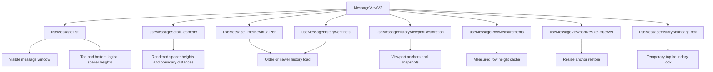
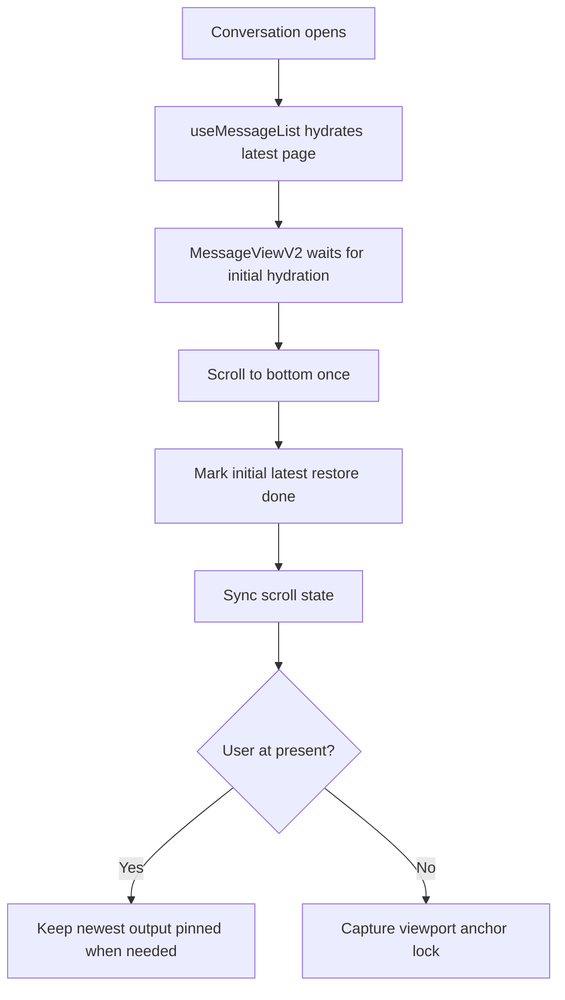
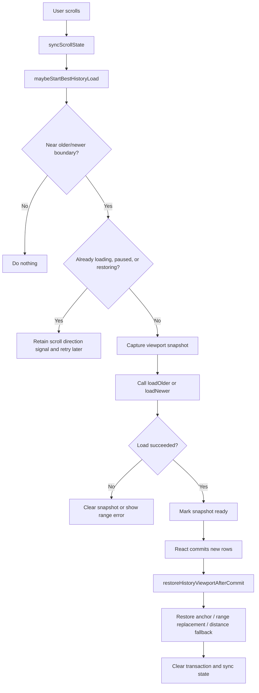
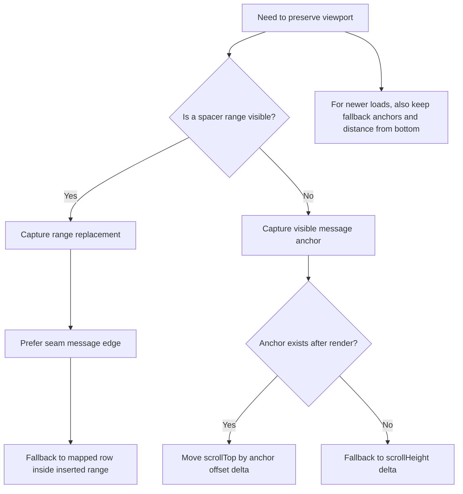
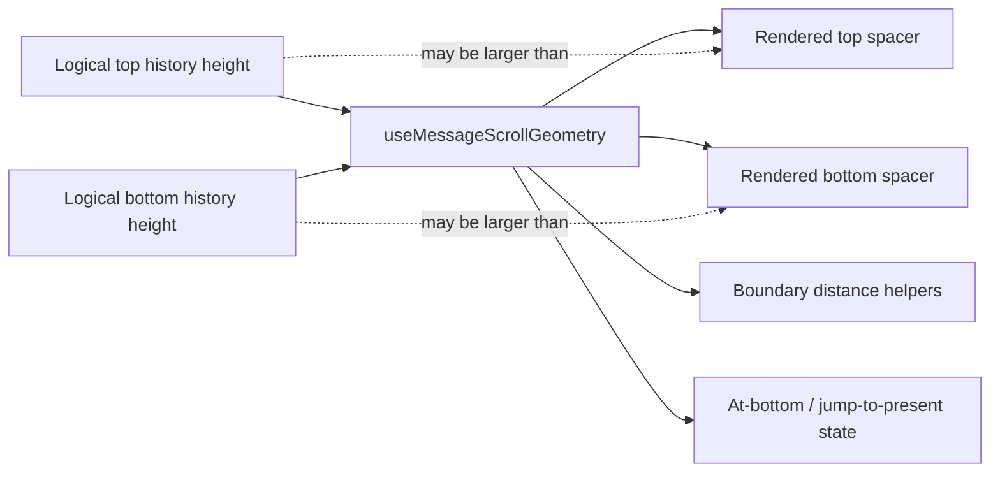
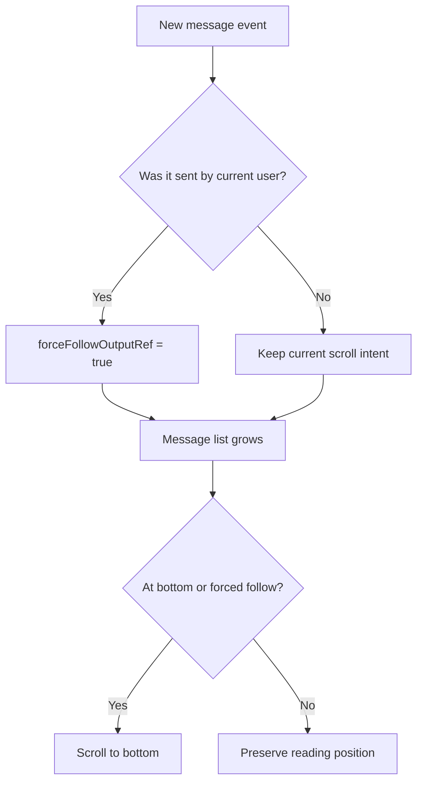
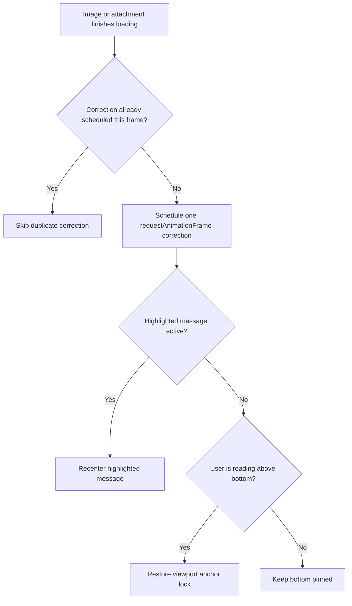

# Message Scroll Mechanism

This page explains how the chat timeline keeps scrolling stable while it trims old pages, loads history in both directions, handles live messages, and lets media finish loading without nudging the user around.

The short version: the scroll system is not one giant trick. It is a few small rules working together:

- keep the newest messages pinned only when the user is actually at the bottom
- keep an anchor near the viewport when the user is reading older messages
- replace logical history gaps with bounded physical spacers so the browser does not carry a huge scroll layer
- capture the viewport before loading history, then restore it immediately after React commits the new rows
- coalesce attachment-load corrections so a group of images does not trigger several tiny scroll fixes

## Main Actors

`MessageViewV2` is still the conductor, but each hook owns one lane:

- `useMessageList` owns the message window, history pages, spacer totals, and message height recording.
- `useMessageScrollGeometry` turns logical history gaps into rendered spacer heights and boundary distance helpers.
- `useMessageTimelineVirtualizer` watches scroll direction and decides when to load older or newer pages.
- `useMessageHistoryViewportRestoration` captures and restores the viewport around history loads.
- `historyScrollAnchors` contains the low-level DOM anchor math.
- `useMessageRowMeasurements` measures real message row heights and refreshes the height cache.
- `useMessageHistorySentinels` is the IntersectionObserver fallback at the history edges.
- `useMessageHistoryBoundaryLock` prevents overscroll/pull-jank while older history is actively loading.
- `useMessageViewportResizeObserver` restores anchors after viewport size changes.

## Normal Render Flow

The first bottom restore is intentionally a one-time action per conversation. After that, the code only follows output if the user is already at the bottom or a send action explicitly asks to jump to present.

## History Load Flow

The important idea is that history loading is treated like a transaction:

- before the load, capture where the viewport is
- during the load, block unrelated scroll compensation
- after the new rows render, restore the same visual position
- then clear the transaction

## Anchor Strategy

There are two different preservation modes:

- Message anchor mode keeps a real visible message at the same viewport offset.
- Range replacement mode maps a visible skeleton/spacer range to the real messages that replace it.

Range replacement is why scrolling through unloaded history feels less jumpy. If the user is looking at a spacer/skeleton area when the real messages arrive, the code maps that region instead of pretending a visible message anchor exists.

## Spacer Model

The logical spacer height is the real history estimate. The rendered spacer height can be capped. This keeps the browser from managing very large physical scroll layers while still letting the app reason about how much history exists above and below the loaded message window.

## Live Message Flow

This is the rule that prevents the timeline from fighting the user. Incoming messages from other people do not yank the viewport if the user is reading above the bottom.

## Attachment Load Polish

Multiple images can finish loading almost at the same time. Without coalescing, each image could ask for its own anchor or bottom correction. The current behavior batches those load events into one correction per animation frame, which keeps the layout stable without hiding real layout changes.

## Why There Are Multiple Guards

The scroll code has several guards because each one protects a different feeling:

- Initial bottom restore protects conversation open.
- Force follow protects own sends.
- Anchor lock protects reading older messages.
- History snapshots protect history pagination.
- Boundary lock protects the top edge while older history is replacing a spacer.
- Resize restore protects viewport changes from keyboard, window resize, or media layout updates.
- Attachment coalescing protects multi-image messages from repeated tiny corrections.

Removing one guard can make the code look simpler while making the chat feel worse.

## Reviewer Checklist

Use this checklist when changing the timeline:

- Opening a conversation lands at the latest message without a visible jump.
- Sending your own message jumps to present, even from history mode.
- Receiving someone else's message does not yank you down while reading older messages.
- Scrolling near the top loads older history without changing the visible reading position.
- Scrolling near the bottom of a context window loads newer history without losing position.
- Jump-to-present appears when there is newer history or enough distance from the bottom.
- Reply jump scrolls to the target message and highlights it.
- A multi-image message finishing load does not create repeated tiny nudges.
- Mobile keyboard or viewport resize does not lose the current reading anchor.

## Code Map

- [MessageViewV2.tsx](/home/void0000/Desktop/VOIDAPP/VOID0000-www/src/components/Chat/MessageView/MessageViewV2.tsx)
- [useMessageList.ts](/home/void0000/Desktop/VOIDAPP/VOID0000-www/src/Services/hooks/Chats/useMessageList.ts)
- [useMessageScrollGeometry.ts](/home/void0000/Desktop/VOIDAPP/VOID0000-www/src/components/Chat/MessageView/useMessageScrollGeometry.ts)
- [useMessageTimelineVirtualizer.ts](/home/void0000/Desktop/VOIDAPP/VOID0000-www/src/components/Chat/MessageView/useMessageTimelineVirtualizer.ts)
- [useMessageHistoryViewportRestoration.ts](/home/void0000/Desktop/VOIDAPP/VOID0000-www/src/components/Chat/MessageView/useMessageHistoryViewportRestoration.ts)
- [historyScrollAnchors.ts](/home/void0000/Desktop/VOIDAPP/VOID0000-www/src/components/Chat/MessageView/historyScrollAnchors.ts)
- [useMessageRowMeasurements.ts](/home/void0000/Desktop/VOIDAPP/VOID0000-www/src/components/Chat/MessageView/useMessageRowMeasurements.ts)
- [useMessageHistorySentinels.ts](/home/void0000/Desktop/VOIDAPP/VOID0000-www/src/components/Chat/MessageView/useMessageHistorySentinels.ts)
- [useMessageHistoryBoundaryLock.ts](/home/void0000/Desktop/VOIDAPP/VOID0000-www/src/components/Chat/MessageView/useMessageHistoryBoundaryLock.ts)
- [useMessageViewportResizeObserver.ts](/home/void0000/Desktop/VOIDAPP/VOID0000-www/src/components/Chat/MessageView/useMessageViewportResizeObserver.ts)
