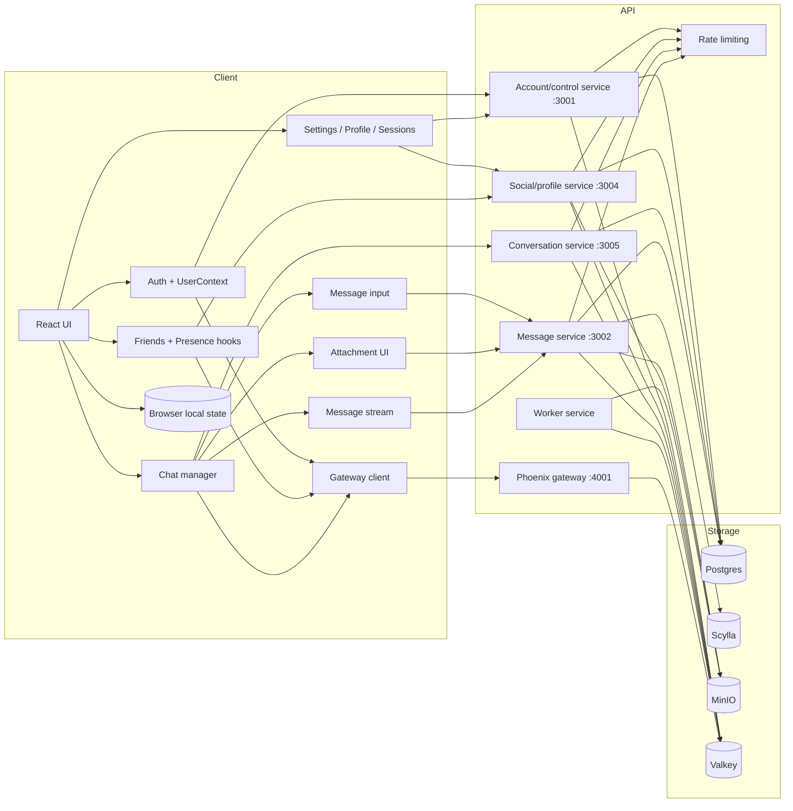
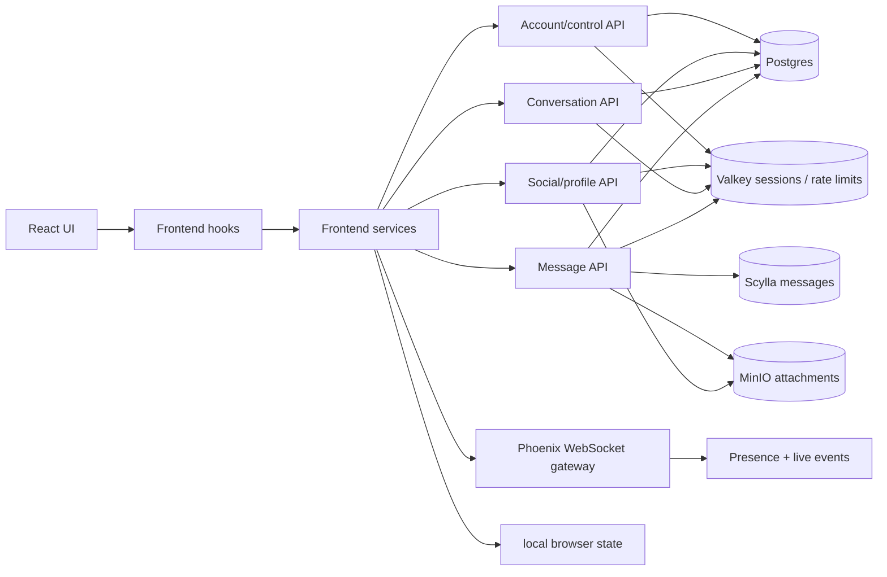
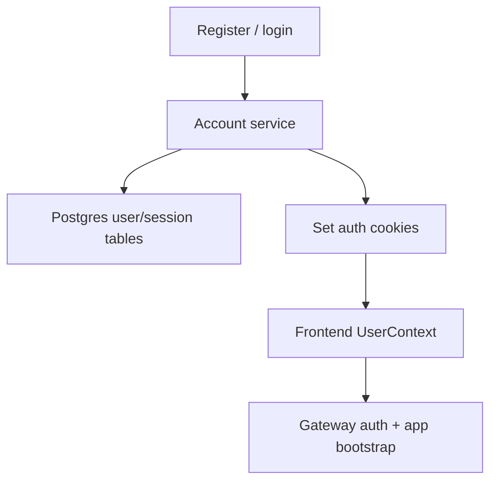
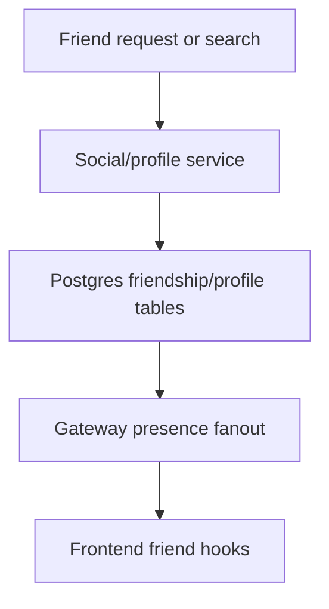
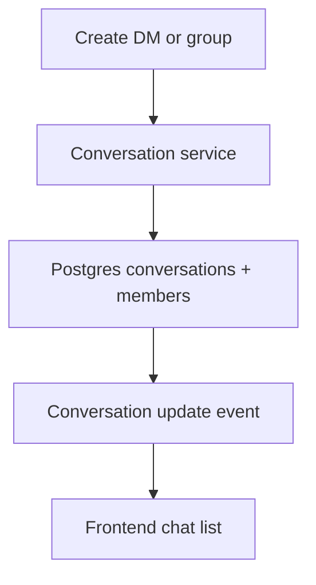
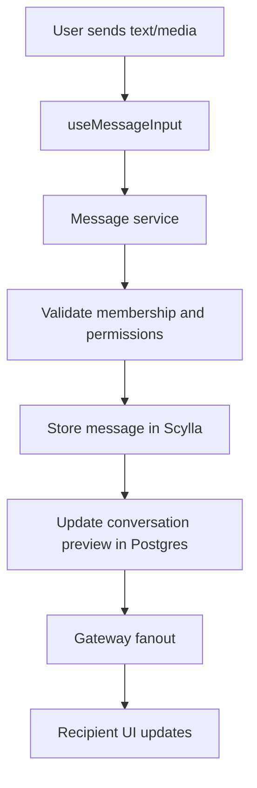
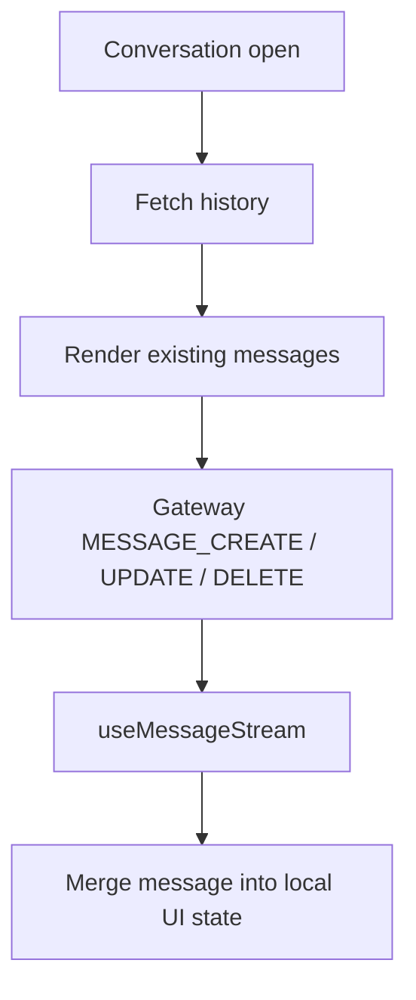
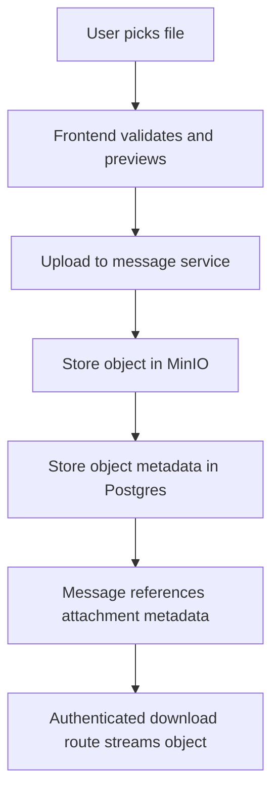
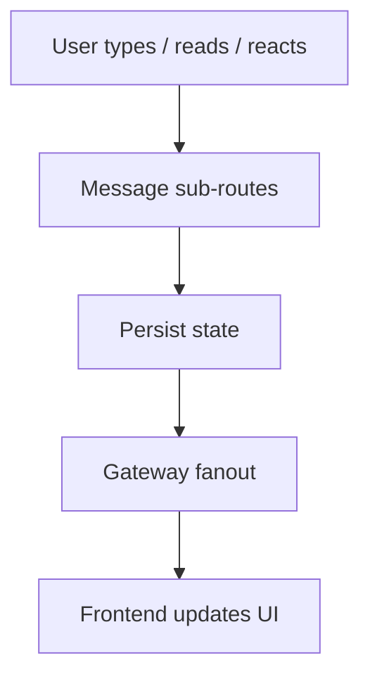

# Project Flow Map

This is the high-level map of the NOTE2EE project so we do not need to keep the system in our heads.

## 0. Master Connected Flow

Use this section as the "how everything connects" map. The sections below zoom into one lane at a time so the details stay readable.

## 1. System Shape

Main frontend layers:

- auth: `src/Services/Auth/UserContext.tsx`, `src/Services/Auth/authServiceApi.ts`
- chat: `src/Services/Chat/chatService.ts`, `src/Services/Chat/messageService.ts`
- gateway: `src/Services/Gateway/gateway.ts`
- message timeline: `src/components/Chat/MessageView`
- message composer: `src/components/Chat/Composer`
- group settings: `src/components/Chat/Groups`

Main backend surfaces:

- account/control service: `server/entrypoints/account-server.js`
- message service: `server/entrypoints/message-server.js`
- social/profile service: `server/entrypoints/social-server.js`
- conversation service: `server/entrypoints/conversation-server.js`
- worker service: `server/entrypoints/worker-server.js`
- Phoenix gateway: `void_gateway`

## 2. Auth Flow

Auth notes:

- passwords are hashed with Argon2id
- access cookies are short-lived
- refresh tokens rotate and are stored server-side as hashes
- CSRF and 2FA use separate server-side secrets
- trust, captcha, and rate-limit state are backed by Valkey

## 3. Friends And Presence Flow

Friendship, profile reads, presence, friend actions, and user search live primarily in the social/profile service.

## 4. Conversation Metadata Flow

Conversation service owns:

- DM creation and group creation
- member list and role changes
- ownership transfer
- leaving or deleting a group
- invites and join requests
- group permissions and nicknames

## 5. Message Send Flow

Relevant files:

- `src/Services/hooks/Chats/useMessageInput.ts`
- `src/Services/Chat/messageService.ts`
- `server/routes/conversations/messages/sendMessage.js`
- `server/routes/conversations/messages/shared.js`

## 6. Message History And Live Stream

History and live stream notes:

- message bodies live in ScyllaDB
- reactions and read state are fetched through message/conversation routes
- the timeline uses scroll preservation and spacer geometry to keep long histories usable
- see `docs/message-scroll-mechanism.md` for the scroll-specific flow

## 7. Attachment Flow

Attachment notes:

- public avatars and group icons are served from public object routes
- chat attachments are private and downloaded through authenticated API routes
- image metadata and blurhash data are generated where needed for the UI

## 8. Typing / Read / Reactions Flow

Relevant files:

- `server/routes/conversations/messages/read.js`
- `server/routes/conversations/reactions.js`
- `server/routes/conversations/batchReactions.js`
- `src/Services/hooks/Chats/useMessageStream.ts`

## 9. Storage Map

- Postgres:
  users, profiles, friendships, refresh tokens, conversation metadata, memberships, permissions, attachment object mapping, notification preferences
- Scylla:
  message timeline storage, edits, reactions, and reaction counts
- MinIO:
  avatars, group icons, and private attachment objects
- Valkey:
  active sessions, rate limits, captcha/trust state, realtime pub/sub, gateway coordination, queue state
- Browser local state:
  UI settings, cached account data, cached conversation data, queued sends, and other client-only runtime state

## 10. Rate Limiting Map

Main limiter exports live in `server/middleware/rate_limit.js`.
Policy definitions live in `server/middleware/rateLimits/policies.js`.

Important buckets:

- auth login
- forgot/reset/register
- auth refresh/check
- friends list
- friends presence
- friend actions
- messages fetch/send
- DM anti-spam guard
- attachment and profile upload paths

## 11. Known Limits

- the app is still a hobby project and should be tested like one
- account deletion is manual in the current tiny deployment
- voice/video calls are intentionally out of scope
- some flows are durable, but edge-case testing still matters for auth, sessions, friends, conversations, messages, attachments, and realtime behavior
